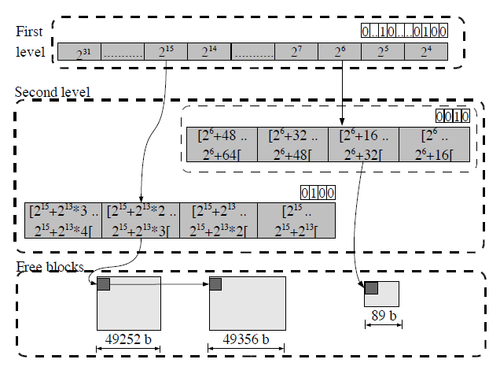

# tlsf-bsd: Two-Level Segregated Fit Memory Allocator

Two-Level Segregated Fit (TLSF) memory allocator implementation derived from the BSD-licensed implementation by [Matthew Conte](https://github.com/mattconte/tlsf).
This code was based on the [TLSF documentation](http://www.gii.upv.es/tlsf/main/docs).

A novel technique called TLSF for dynamic memory allocation that maintains the effectiveness of the allocation and deallocation operations with a temporal cost of O(1).
For long-running applications, the fragmentation issue also has a greater influence on system performance.
The proposed method also produces a limited and tiny fragmentation.

This implementation was written to the specification of the document,
therefore no GPL restrictions apply.

## Features
* O(1) cost for `malloc`, `free`, `realloc`, `aligned_alloc`
* Low overhead per allocation (one word)
* Low overhead for the TLSF metadata (~4kB)
* Low fragmentation
* Very small - only ~500 lines of code
* Compiles to only a few kB of code and data
* Uses a linear memory area, which is resized on demand
* Not thread safe. API calls must be protected by a mutex in a multi-threaded environment.
* Works in environments with only minimal libc, uses only `stddef.h`, `stdbool.h`, `stdint.h` and `string.h`.

## Design principals
1. Immediate coalescing: As soon as a block is freed, the algorithm is designed to merge the freed block with adjacent free blocks ,if any, to build up larger free block.
2. Splitting threshold: The smallest block of allocatable memory is 16 bytes. By this limit, it is possible to store the information needed to manage them, including the list of free blocks pointers.
3. Good-fit strategy: TLSF uses a large set of free lists where each list is a non-ordered list of free blocks whose size is between the size class and the new size class. Each segregated list contains blocks of the same class.
4. Same strategy for all block sizes: Some dynamic storage allocation (DSA) algorithms use different allocation strategies for different requested sizes. TLSF uses the same strategy for all sizes which provide uniform behavior, thus predictable WCET.
5. Memory is not cleaned-up: In multi-user environments, DSA algorithms have to clean the memory by usually filling with zeros in order to avoid security problems. In TLSF, since we assume the algorithm will be used in a trusted environment, the algorithm does not clean up the memory when allocating which would bring considerable overhead.

## How it works

This package offers constant, O(1)-time memory block allocation and deallocation, by means of segregated fit mechanism.

Two-level structure to speedup access and reduce fragmentation.
* First level: Divides free blocks in classes of power of 2
* Second level: Divides the size range indicated by the first level by 4. e.g., 2^6 first level covers the range of free list blocks of [2^6,2^7)
  - This range is divided into 4 equidistant blocks.

The structure consists of an array indexed by `log(2, requested_size)`.
In other words, requests are divided up according to the requsted size's most significant bit (MSB).
A pointer to the second level of the structure is contained in each item of the array.
At this level, the free blocks of each slab size are divided into x additional groups,
where x is a configurable number.
An array of size x that implements this partitioning is indexed by taking the value of the `log(2, x)` bits that follow the MSB.
Each value denotes the start of a linked list of free blocks (or is `NULL`).

Finding a free block in the correctly sized class (or, if none are available, in a larger size class) in constant time requires using the bitmaps representing the availability of free blocks (of a certain size class).

When `tlsf_free()` is called, the block examines if it may coalesce with nearby free blocks before returning to the free list.

### Finding a free block in TLSF `malloc()`

TLSF searches for a free block for a request in the order:
1. First level index and second level index corresponding to the request is calculated. The indices are checked if a free block is available. If a free block is available at the indices, the block is returned.
2. If a free block is not available at the indices, remaining second level indices are searched to find a free block. If a free block is available, it is returned.
3. If not found, the next first level index whose value is 1 in the bitmap is searched to find a free block which guarantees to find a free block.

#### Worst case happens when
1. The first level index calculated for the requested size is 1 and second level indices are examined which results in a fail to find a free block = or > the requested size.
2. The next free block available is on the right-most free-blocks list of the second level of the left-most first level index. When a small block is requested with size x, x bytes will be extracted from this huge block and returned. The remaining huge block going to the lower first level index results in the most overhead for this allocation operation.

### Freeing a block in TLSF `free()`
1. When a block is freed, the first thing done is to check if the physical neighbour blocks are free or not.
2. If either of the neighbours are free, it is merged with the newly freed block. After the merge, new big block is inserted in the appropriate segregated list. (Mapping function is used to find first level and second level indices of the block)
3. If neither of the neighbours are free, only the freed block is put on to the appropriate place in the segregated list.

## Reference

M. Masmano, I. Ripoll, A. Crespo, and J. Real.
TLSF: a new dynamic memory allocator for real-time systems.
In Proc. ECRTS (2004), IEEE Computer Society, pp. 79-86.

## Related Projects

* [tlsf-pmr](https://github.com/LiemDQ/tlsf-pmr): a memory resource for use with `polymorphic_allocator` that uses the Two-Level Segregated Fit algorithm as an allocation scheme.

## Licensing

TLSF-BSD is freely redistributable under the 3-clause BSD License.
Use of this source code is governed by a BSD-style license that can be found
in the `LICENSE` file.
